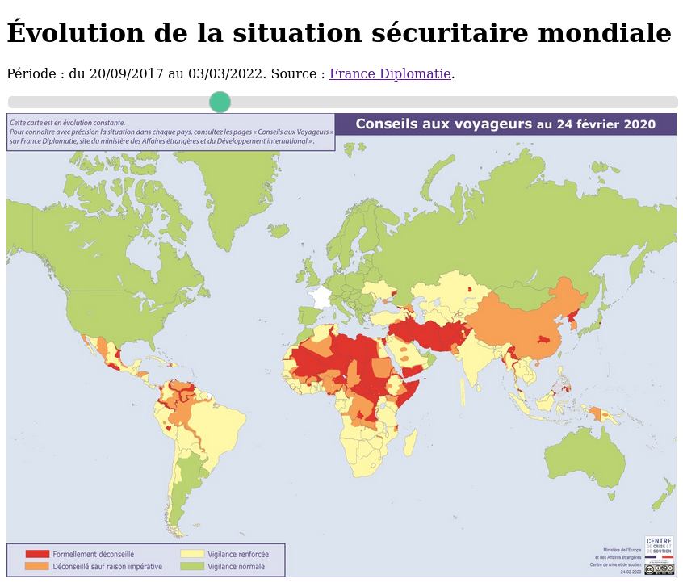

# :earth_asia: Diplomap

Observez l’évolution de la situation sécuritaire mondiale vue par la diplomatie française ([diplomatie.gouv.fr](https://www.diplomatie.gouv.fr/fr/conseils-aux-voyageurs)).

## :dart: Résultat

Voici ce que vous obtiendrez :

## :white_check_mark: Utilisation

- pour observer les cartes des différentes dates, ouvrez le fichier `index.html` dans un navigateur internet (fonctionne sur Firefox).

- pour récupérer les cartes plus récentes, utilisez `diplomap.py`, qui va automatiquement chercher les cartes sur https://web.archive.org.

## :busts_in_silhouette: Contributions

Fabrice Lécuyer, 2022

Ce projet n'est pas officiel et n'est lié ni à France Diplomatie ni à Web Archive.

#### :bulb: Idées pour participer
- [ ] trouver les cartes datant d'avant 2017.
- [ ] rapporter un bug dans les [issues](./issues) (il faut créer un compte github).
- [ ] suggérer une amélioration dans les [issues](./issues).
- [ ] tester de nouveaux navigateurs (Opéra, Safari, Edge, etc).
